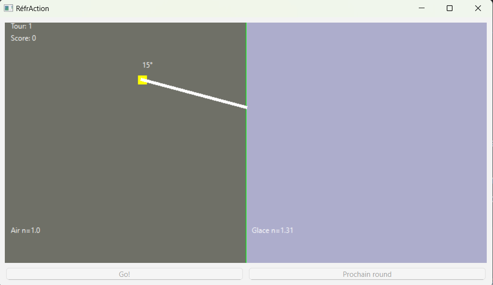
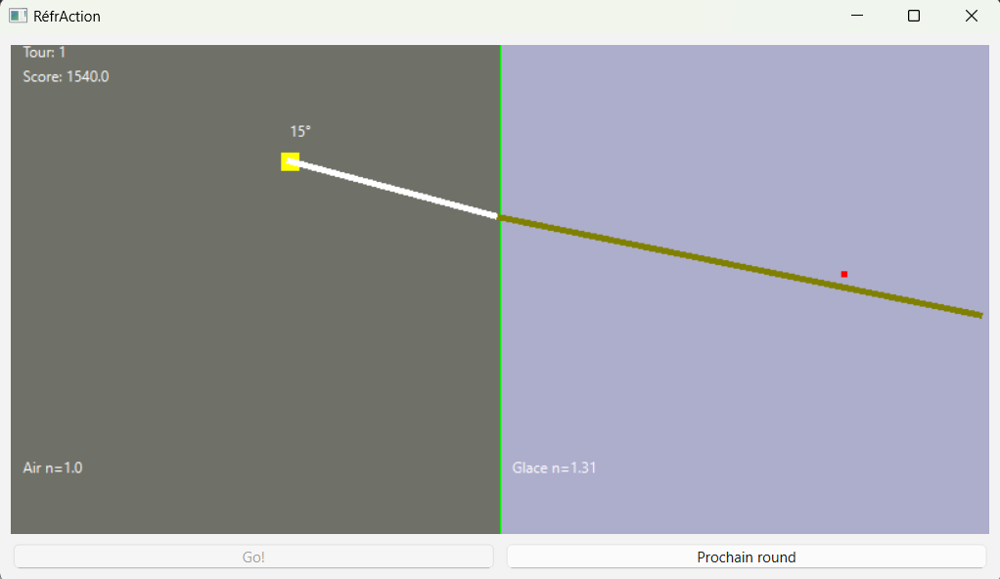

# RéfrAction

# Lois de Snell-Descartes pour la réfraction de la lumière
Les lois de Snell-Descartes décrivent la réflexion et la réfraction de la lumière.
Ces principes ont été découverts simultanément par Willebrord Snell et René Descartes (eh oui, le même Descartes, mathématicien, physicien, philosophe, etc) en 1621.
Pour ce programme, nous allons nous concentrer sur la réfraction de la lumière.
[Loi de Snell-Descartes](https://fr.wikipedia.org/wiki/Loi_de_Snell-Descartes)

# Survol de l'application
Vous devez concevoir un jeu scientifique qui modélise la réfraction de la lumière à travers différents milieux à partir
d'une source lumineuse dont la position et l'angle seront générés aléatoirement.

Le joueur devra ajouter une cible à l'endroit où il pense que le rayon lumineux va se retrouver après la réfraction.
Le joueur pourra ensuite vérifier sa réponse et obtenir un score basé sur la distance entre la cible et la position réelle du rayon lumineux.

# Prérequis
- Python 3.12
- PySide6

Les bibliothèques externes sont autorisées (ex: numpy, scipy, etc).

# Séquence de jeu
## Début de tour
1. Le jeu va générer aléatoirement une position et un angle pour la source lumineuse.
2. Le joueur doit ajouter une cible à l'endroit où il pense que le rayon lumineux va se retrouver après la réfraction.
3. Le joueur peut déplacer la cible à sa guise avant de soumettre sa réponse.
4. Le joueur soumet sa réponse.
5. Le joueur ne peut pas passer au tour suivant tant qu'il n'a pas soumis sa réponse.

image à titre indicatif seulement, veuillez lire le détail des requis.
## Fin de tour
1. Le jeu affiche la position réelle du rayon lumineux après la réfraction.
2. Le jeu calcule la distance entre la cible du joueur et la position réelle du rayon réfracté pour déterminer son score.
3. Le joueur peut passer au tour suivant.
4. Le joueur ne peut pas soumettre de réponse tant qu'il n'a pas passé au tour suivant.

image à titre indicatif seulement, veuillez lire le détail des requis.
## Fin de partie
1. Après la fin du troisième tour, un écran de fin de partie s'affiche.

# Critères d'évaluation
Ce travail pratique compte pour 20% de la note finale.
Doit être fait en équipe de 2 ou 3 personnes. Pas de travail individuel.

La répartition des points est la suivante:
- 12 points: dessins sur canevas et interface en général (beauté, clarté, etc)
- 5 points: logique de jeu (calcul du score, calcul de la réfraction, etc)
- 3 points: qualité du code (lisibilité, respect des normes Python, etc)

Éléments de l'interface graphique à inclure:
- Canevas de grandeur fixe (800x400) pour afficher les éléments du jeu
- Widget pour soumettre la réponse
- Widget pour passer au tour suivant
- La fenêtre doit s'appeler "RéfrAction"
- Vous pouvez ajouter des éléments à votre guise pour améliorer l'expérience utilisateur.
- Vous pouvez remplacer les points par des images pour la cible et la source lumineuse.
    - Cependant, l'image doit être centrée sur la position de la cible ou de la source lumineuse.

États du jeu:
- DEBUT_TOUR: le joueur doit ajouter une cible et soummettre sa réponse.
- FIN_TOUR: le jeu affiche le résultat de la réfraction.
- FIN_PARTIE: le jeu affiche l'écran de fin de partie.

Explication des méthodes à implémenter:
La structure du code vous est fournie. Vous pouvez ajouter des méthodes et des attributs à votre guise.
- Ne pas renommer les méthodes présentes.

**def dessiner_fond_ecran(self) -> None:**
- Cette méthode doit dessiner le fond de l'écran.
- Doit intialiser le canevas avec une couleur de fond.

**def dessiner_source_lumineuse(self) -> None:**
- Cette méthode doit dessiner la source lumineuse.
- La source lumineuse doit être représentée par un cercle de couleur jaune par défaut (largeur de 15 pixels).
  - Peut être remplacée par une image si désiré.
- Cette méthode doit également afficher l'angle de la source lumineuse.
- L'angle doit être affiché en degrés.
- Cette méthode doit aussi dessiner le rayon lumineux jusqu'à la division.

**def dessiner_division(self) -> None:**
- Cette méthode doit dessiner la division entre les deux milieux.
- La division doit être représentée par une ligne verticale verte.

**def dessiner_cible(self) -> None:**
- Cette méthode doit dessiner la cible si existante.
- La cible doit être représentée par un cercle de couleur rouge par défaut (largeur de 5 pixels).
  - Peut être remplacée par une image si désiré.

**def dessiner_milieu_incident(self) -> None:**
- Cette méthode doit dessiner le milieu incident.
- Le milieu incident doit être représenté par un rectangle de la couleur du milieu incident.
- Le rectangle doit couvrir la surface de l'écran à gauche de la division.
- Le nom et l'indice de réfraction doit être affiché à l'écran.

**def dessiner_milieu_refracte(self) -> None:**
- Cette méthode doit dessiner le milieu réfracté.
- Le milieu réfracté doit être représenté par un rectangle de la couleur du milieu réfracté.
- Le rectangle doit couvrir la surface de l'écran à droite de la division.
- Le nom et l'indice de réfraction doit être affiché à l'écran.

**def dessiner_rayon_refracte(self) -> None:**
- Cette méthode doit dessiner le rayon réfracté.
- Le rayon réfracté doit être représenté par une ligne de couleur.
- La couleur du rayon réfracté doit être différente de celle du rayon incident.
- Le rayon réfracté doit partir de la division et sortir de l'écran.
- Cette méthode doit également afficher l'angle du rayon réfracté.
- L'angle doit être affiché en degrés.

**def dessiner_hud(self) -> None:**
- Cette méthode doit dessiner le HUD (heads up display).
- Le HUD doit afficher le score du joueur.
- Le HUD doit afficher le nombre de points effectués par le joueur au tour précédent.
- Le HUD doit afficher le numéro du tour actuel.
  - Le premier tour doit être numéroté 1.

**def afficher_ecran_fin(self) -> None:**
- Cette méthode doit afficher l'écran de fin de partie.
- L'écran de fin de partie doit afficher le score final du joueur.
- L'écran de fin de partie doit afficher un message de félicitations.
- L'écran de fin de partie doit afficher un bouton pour quitter le jeu.
- Le design de l'écran de fin de partie est laissé à votre discrétion en autant que les éléments mentionnés ci-dessus soient présents.

**def calculer_score(self) -> None:**
- Cette méthode doit calculer le score du joueur.
- Le score doit être basé sur la distance entre la cible et la droite du rayon réfracté.
  - La formule pour le score est la suivante: score = (200 - distance jusqu'au rayon réfracté) * (distance jusqu'à la division / 2)
  - Vous pouvez le calculer manuellement ou utiliser numpy pour le calcul.

**def nouveau_tour(self) -> None:**
- Cette méthode doit initialiser un nouveau tour.
- La source lumineuse doit être générée aléatoirement.
  - La position de la source lumineuse doit être:
    - x: entre 50 et 300
    - y: entre 50 et 350
    - angle: 
      - entre 0 et 35 degrés si y < 200
      - entre -35 et 0 degrés si y >= 200
- La cible doit être effacée.
- Un milieu incident et un milieu réfracté doivent être générés aléatoirement.
- Le numéro du tour doit être incrémenté.
- L'état du jeu doit être changé pour "DEBUT_TOUR".

**def jouer_tour(self) -> None:**
- L'état du jeu doit être changé pour "FIN_TOUR".
- Le score devra être calculé.
- Si on est au tour 3, l'état du jeu doit être changé pour "FIN_PARTIE".

## Rappel
Le système de coordonnées:
- L'origine du système de coordonnées est le coin supérieur gauche de l'écran.
- L'axe des x est de gauche à droite.
- L'axe des y est de haut en bas.
- Les angles augmentent dans le sens horaire.

# Points Bonis
- 1 point: Ajouter la possibilité de redémarrer une nouvelle partie à partir de l'écran de fin de partie.
- 1 point: Ajouter une animation thématique (feux d'artifice, bonhomme dansant, etc) sur l'écran de fin de partie.

